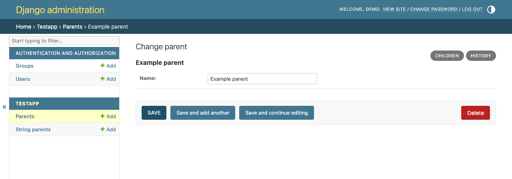
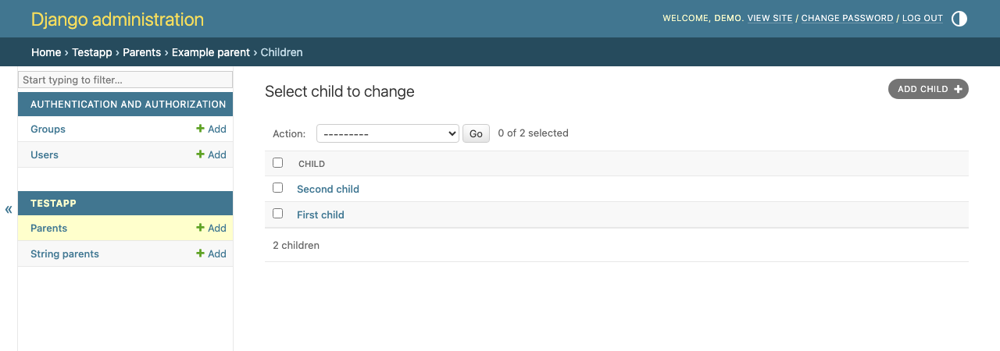
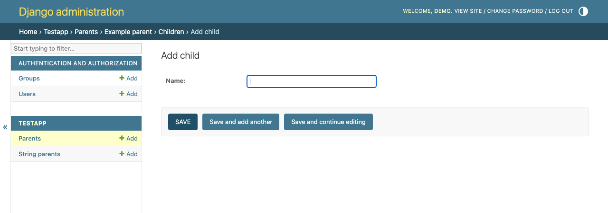

# django-subadmin

`django-subadmin` lets a `ModelAdmin` live under another `ModelAdmin`. When
related objects have outgrown an inline, a `SubAdmin` gives them their own list
and change pages, with search, filters, and pagination scoped to a parent
object. Subadmins can be nested several levels deep.

## Compatibility

| django-subadmin | Django | Python |
| --- | --- | --- |
| 5.2.x | 5.2, 6.0 | 3.10+ |
| 3.2.x | 3.2, 4.x, 5.x | 3.6+ |

The package version follows the oldest Django version supported by that line.
The 5.2 release drops support for Django before 5.2 and Python before 3.10.

## Installation

```console
pip install django-subadmin
```

Add `subadmin` to `INSTALLED_APPS` so Django can find its templates:

```python
INSTALLED_APPS = [
    # Django's contrib apps and your own apps...
    "subadmin",
]
```

## Example

The test app has a `Parent` model with related `Child` objects. Django's inline
admin would put the children on the parent's form; a `SubAdmin` gives each
parent its own child changelist instead.

```python
# models.py
from django.db import models


class Parent(models.Model):
    name = models.CharField(max_length=100)


class Child(models.Model):
    parent = models.ForeignKey(Parent, on_delete=models.CASCADE)
    name = models.CharField(max_length=100)
```

```python
# admin.py
from django.contrib import admin
from subadmin import RootSubAdmin, SubAdmin

from .models import Child, Parent


class ChildAdmin(SubAdmin):
    model = Child


@admin.register(Parent)
class ParentAdmin(RootSubAdmin):
    subadmins = (ChildAdmin,)
```

Open a parent in the admin and follow the link to its child admin. The child
pages show only records for that parent. The parent foreign key is set
automatically when adding a child and omitted from the nested form.

The [test app models](tests/testapp/models.py) and
[admin configuration](tests/testapp/admin.py) also show deeper nesting. Their
workflows are covered by [integration tests](tests/test_admin.py), which you
can run from a source checkout with:

```console
python -m django test tests --settings=tests.settings
```

## Screenshots

The parent change page links to its child admin.



The child changelist contains only that parent's children.



The child add form omits the parent foreign key, which is set automatically.



## Labels

Set `subadmin_label` to change a subadmin link and its collection breadcrumbs
without renaming the model:

```python
class ChildAdmin(SubAdmin):
    model = Child
    subadmin_label = "Members"
```

The default is the model's `verbose_name_plural`. Object breadcrumbs and other
model names keep their usual Django wording. Override
`get_subadmin_label(request)` if the label needs to vary by request.

## Upgrading from 3.2

Parent objects are now loaded through the parent admin's `get_object()` method,
so custom `get_queryset()` filters affect nested pages. Each parent in the URL
must also pass that admin's `has_view_or_change_permission(request, obj)` check.
A parent hidden by the queryset returns 404; a visible parent without permission
returns 403. Child permissions alone no longer grant access through a parent.

If you need the previous direct model lookup while adapting a project, set:

```python
SUBADMIN_USE_DIRECT_PARENT_LOOKUP = True
```

This changes how parents are loaded, but does not skip the parent permission
check.

Custom overrides of `get_parent_instance()` and `get_subadmin_helper()` need to
accept `request` as their first argument after `self`. Their signatures are now
`get_parent_instance(self, request, parent_id)` and
`get_subadmin_helper(self, request, view_args, object_id=None)`.

`SubAdmin` wraps forms to validate parent-scoped fields. If you override
`get_form()` or `get_changelist_form()`, call `super()` so that wrapping still
runs.
